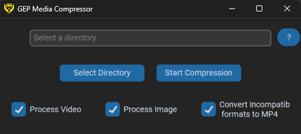
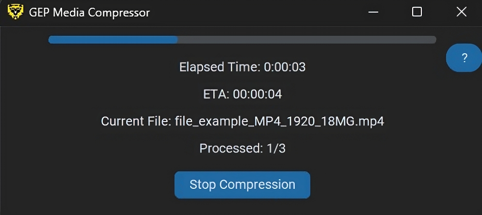

# GEP Media Compressor

A Python-based desktop application for efficient video and image compression with drag-and-drop support.

## Related army projects
This repository is part of a series of automation apps that I created during my service in the Information and Research Bureau in the Greek Army.
### Similar projects.
- [weekly_report_automator](https://github.com/GiorgosNik/weekly_report_automator):
C# application for automated PowerPoint report generation.
- [powerpoint_automator](https://github.com/GiorgosNik/powerpoint_automator):
Python automation tool for generating weather forecast videos.

## Features

- Video and image compression
- Drag-and-drop file handling
- Progress tracking with ETA
- Format conversion support
- Cross-platform compatibility (Windows/Linux)
- Simple and intuitive UI

<div style="display: inline-block; width: 400px;">
    
    <p style="text-align: center;"><em>Initial UI state</em></p>
</div>

<div style="display: inline-block; width: 400px;">
    
    <p style="text-align: center;"><em>Compression in progress</em></p>
</div>

## Technical Overview

### Core Technologies
- Python 3.12
- CustomTkinter for modern UI
- FFmpeg for video processing
- Pillow for image handling
- TkinterDnD for drag-and-drop
- PyInstaller for executable creation

### Architecture
- `ui/`: UI components and main application window
- `utils/`: Core functionality handlers
- `tests/`: Comprehensive test suite
- GitHub Actions for CI/CD

### Testing
- pytest framework
- Mocking for external dependencies
- Coverage reporting via pytest-cov

## User Guide

### Installation
1. Download latest release from GitHub
2. Run installer
3. Launch application from desktop shortcut

1. Select input directory via:
        - Browse button
        - Drag-and-drop folder
        - Manual path entry
2. Configure options:
        - Video processing (reduces size by ~80%)
        - Image processing (reduces size by ~70%)
        - Format conversion (converts H264 to MP4)
3. Click "Start Compression"
4. Monitor progress with real-time updates

### Supported File Types
- Videos: .mp4, .avi, .mkv, .mov, .wmv, .flv, .webm, .mpeg, .3gp, .ogv, .m4v, .ts, .vob, .asf, .rm, .mts
- Images: .jpg, .jpeg, .png, .tiff
- Convertible: .h264 (auto-converts to .mp4)

### Output Structure
- Creates timestamped output folder (e.g., "output_DD-MM-YYYY_HH-MM-SS")
- Maintains original folder hierarchy
- Preserves original filenames with same extensions
- Includes compression logs

### File Processing
- Videos are tagged with "compressed" metadata
- Tagged files are automatically skipped in future operations
- Images store compression status in EXIF data
- Progress bar shows ETA and current file

## Development

### Setup
```bash
pip install -r requirements.txt
python main.py
```

### Testing
```bash
pytest tests/
```

## Support
Issues: GitHub Issues
Contact: giorgosnl17@gmail.com
